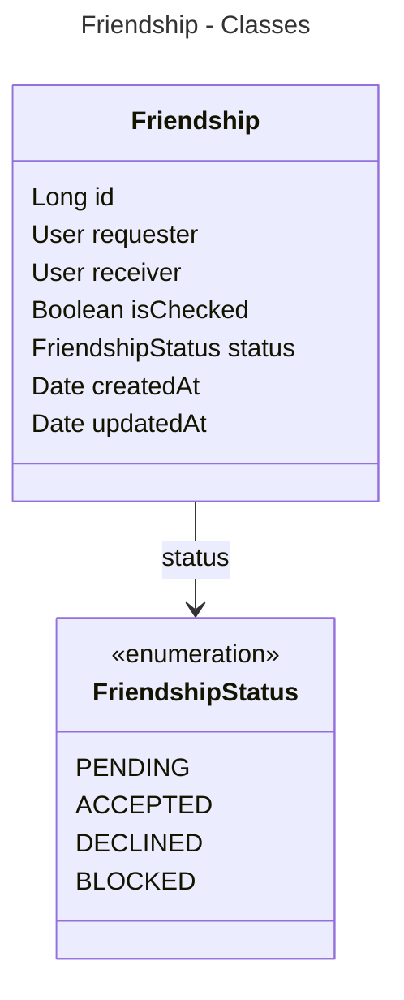

## FriendShip entity

```mermaid
---
title: Friendship - Classes
---
classDiagram
Friendship --> FriendshipStatus : status
class Friendship{
    Long id
    User requester 
    User receiver  
    Boolean isChecked
    FriendshipStatus status
    Date createdAt
    Date updatedAt
}

class FriendshipStatus{
    <<enumeration>>
    PENDING
    ACCEPTED
    DECLINED
    BLOCKED
}
```