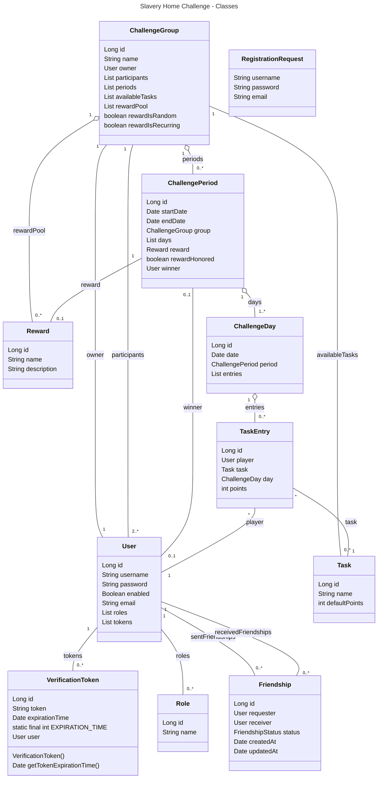

```mermaid
---
title: Slavery Home Challenge - Classes
---
classDiagram
%% ========================
%% Relations système d'auth
%% ========================
    User "1" -- "0..*" VerificationToken: tokens
    User "1" -- "0..*" Role: roles

    User "1" -- "0..*" Friendship: sentFriendships
    User "1" -- "0..*" Friendship: receivedFriendships

%% ========================
%% Relations challenge
%% ========================
    ChallengeGroup "1" -- "1" User: owner
    ChallengeGroup "1" -- "2..*" User: participants
    ChallengeGroup "1" o-- "0..*" ChallengePeriod: periods
    ChallengeGroup "1" -- "0..*" Task: availableTasks
    ChallengeGroup "1" o-- "0..*" Reward: rewardPool
    
    ChallengePeriod "1" o-- "1..*" ChallengeDay: days
    ChallengePeriod "1" -- "0..1" Reward: reward
    ChallengePeriod "0..1" -- "0..1" User: winner
    
    ChallengeDay "1" o-- "0..*" TaskEntry: entries
    TaskEntry "*" -- "1" Task: task
    TaskEntry "*" -- "1" User: player

%% ========================
%% Classes
%% ========================

class User{
    Long id
    String username
    String password
    Boolean enabled
    String email
    List<Role> roles
    List<VerificationToken> tokens
}

class Friendship{
    Long id
    User requester 
    User receiver  
    FriendshipStatus status
    Date createdAt
    Date updatedAt
}

class Role{
    Long id
    String name
}

class RegistrationRequest{
    String username
    String password
    String email
}

class VerificationToken{
    Long id
    String token
    Date expirationTime
    static final int EXPIRATION_TIME
    User user
    VerificationToken()
    Date getTokenExpirationTime()
}

class ChallengeGroup{
    Long id
    String name
    User owner
    List<User> participants
    List<ChallengePeriod> periods
    List<Task> availableTasks
    List<Reward> rewardPool
    boolean rewardIsRandom
    boolean rewardIsRecurring
}

class ChallengePeriod{
    Long id
    Date startDate         
    Date endDate            
    ChallengeGroup group
    List<ChallengeDay> days
    Reward reward           
    boolean rewardHonored  
    User winner            
}

class ChallengeDay{
    Long id
    Date date
    ChallengePeriod period
    List<TaskEntry> entries
}

class Task{
    Long id
    String name            
    int defaultPoints      
}

class TaskEntry{
    Long id
    User player              
    Task task                
    ChallengeDay day         
    int points               
}

class Reward{
    Long id
    String name
    String description
}


```

enum FriendshipStatus{
PENDING
ACCEPTED
DECLINED
BLOCKED
}