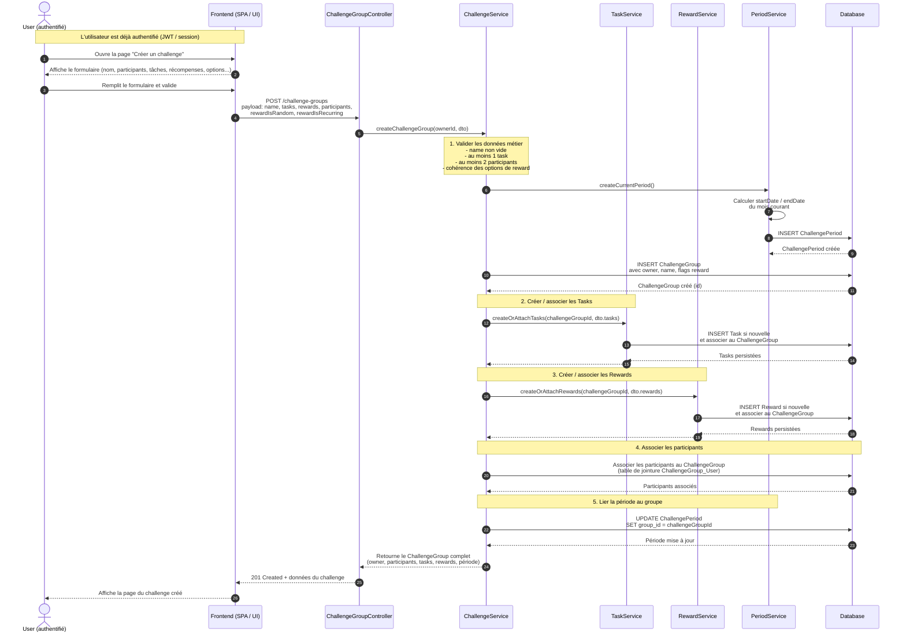
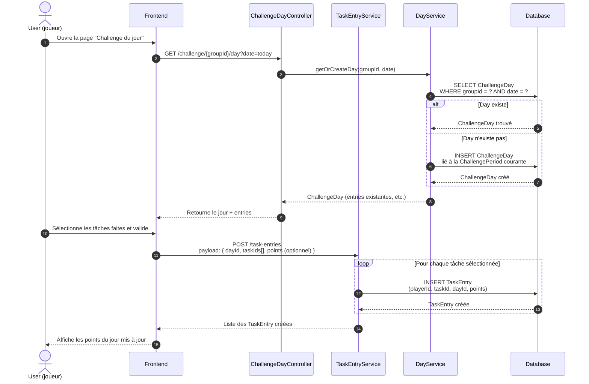
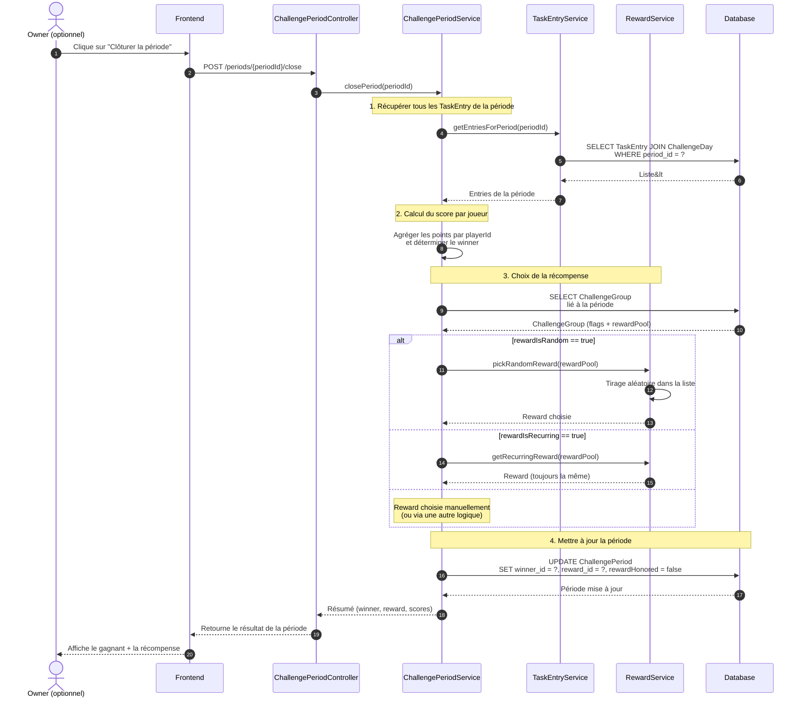

## 1️⃣ Vue d’ensemble – Workflow utilisateur (plan de dev)

Un utilisateur authentifié peut :

1. **S’authentifier**

    * [OK]

2. **Créer un `ChallengeGroup`**

    * Saisir : le nom du groupe.
    * (Optionnel) Vérifier que l’utilisateur n’a pas déjà un challenge actif pour le mois en cours.
    * Générer / associer la **`ChallengePeriod` courante** (mois en cours).
    * Définir la **liste des `Task`** du groupe (`availableTasks`).
    * Définir la **liste des `Reward`** (`rewardPool`).
    * Configurer :

        * `rewardIsRandom`
        * `rewardIsRecurring`
    * Ajouter les **participants** (de son groupe de friendship y compris lui-même).

3. **Pendant le mois : jouer**

    * Consulter la page du jour (`ChallengeDay`).
    * Enregistrer des actions :

        * pour chaque tâche effectuée → créer une `TaskEntry`.
    * Les points s’accumulent dans `TaskEntry.points`.

4. **Fin de période (`ChallengePeriod`)**

    * Calculer les scores par joueur (somme des `TaskEntry.points` de la période).
    * Déterminer le **`winner`**.
    * Choisir la **`Reward`** pour la période :

        * soit via `rewardIsRandom`,
        * soit via `rewardIsRecurring`,
        * soit manuellement.
    * Mettre `rewardHonored` à `true` lorsque la récompense a été effectivement donnée.

**Phases de dev** :

1. Auth + boilerplate
2. Création de challenge
3. Enregistrement des tâches
4. Clôture / scoring / reward

---

## 2️⃣ Diagramme de séquence – Création d’un `ChallengeGroup`

Ici on montre :
**User authentifié → Front → Backend → Services → DB**

👉 Ce diagramme te donne **directement la liste des méthodes à créer** :

* `ChallengeService.createChallengeGroup(...)`
* `PeriodService.createCurrentPeriod()`
* `TaskService.createOrAttachTasks(...)`
* `RewardService.createOrAttachRewards(...)`
* plus les opérations `INSERT/UPDATE` associées côté repository / DAO.

---

## 3️⃣ Diagramme de séquence – Jouer un jour (enregistrer des tâches)

Workflow : *un user va sur la page du jour et enregistre ce qu’il a fait.*

**Règles métier impliquées ici :**

* Créer le `ChallengeDay` s’il n’existe pas encore.
* Vérifier que :

    * l’utilisateur est **participant du `ChallengeGroup`**,
    * la `Task` choisie fait bien partie de `ChallengeGroup.availableTasks`,
    * la date est bien dans la `ChallengePeriod` (on ne joue pas sur un mois déjà clôturé).

---

## 4️⃣ Diagramme de séquence – Clôture du mois (calcul du gagnant + reward)

La clôture peut être :

* soit déclenchée automatiquement (cron),
* soit lancée par le owner via un bouton "Clôturer la période".

Plus tard, quand la récompense est réellement donnée :

* tu auras un endpoint du style : `PATCH /periods/{id}/reward/honored`
* qui met `rewardHonored = true`.

---

## 5️⃣ Comment t’en servir concrètement pour le dev

### Étape 1 – Création de challenge

* [ ] Endpoint `POST /challenge-groups`
* [ ] `ChallengeService.createChallengeGroup(...)`
* [ ] `PeriodService.createCurrentPeriod(...)`
* [ ] `TaskService.createOrAttachTasks(...)`
* [ ] `RewardService.createOrAttachRewards(...)`
* [ ] Association des participants au `ChallengeGroup`

### Étape 2 – Gestion des jours & entrées

* [ ] Endpoint `GET /challenge/{id}/day?date=...`
* [ ] `DayService.getOrCreateDay(...)`
* [ ] Endpoint `POST /task-entries`
* [ ] `TaskEntryService.createEntries(...)`

### Étape 3 – Clôture de période

* [ ] Endpoint `POST /periods/{id}/close`
* [ ] `ChallengePeriodService.closePeriod(...)`
* [ ] `TaskEntryService.getEntriesForPeriod(...)`
* [ ] Calcul des scores + winner
* [ ] Choix de la reward (random / recurring / autre)
* [ ] Mise à jour de `winner`, `reward`, `rewardHonored = false`

